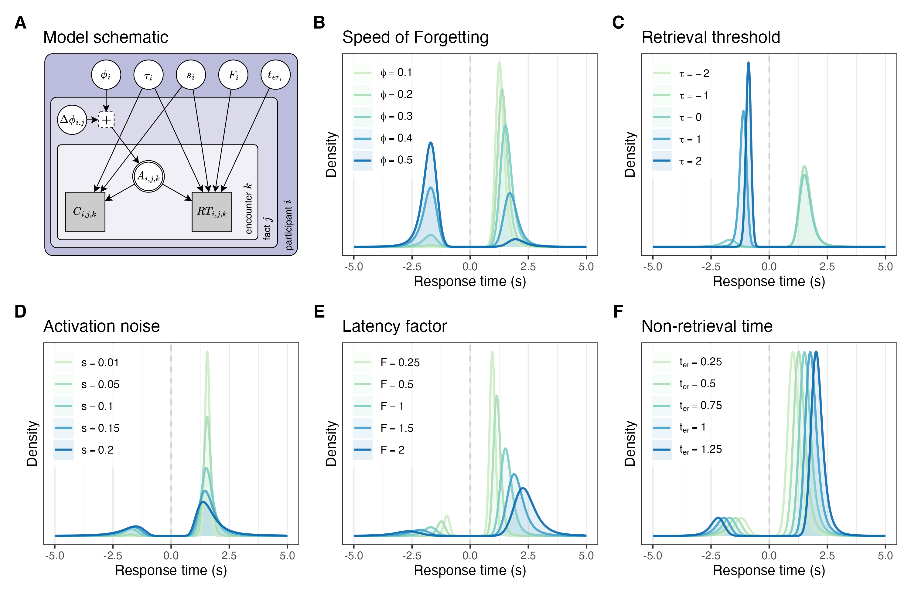

Idiographic Memory Modelling in ACT-R using Alternating Maximum
Likelihood Estimation
================
Maarten van der Velde
Last updated: 2026-06-30

- [ACT-R memory model](#act-r-memory-model)
- [Activation function](#activation-function)
- [Likelihood functions](#likelihood-functions)
  - [Response accuracy](#response-accuracy)
  - [Response time](#response-time)
- [How do parameters map onto
  behaviour?](#how-do-parameters-map-onto-behaviour)
- [Combined log-likelihood function](#combined-log-likelihood-function)

``` r
library(here)
```

    ## here() starts at /Users/thomaswilschut/Documents/GitHub/idiographic-memory-modelling-actr-amle

``` r
library(data.table)
library(janitor)
```

    ## 
    ## Attaching package: 'janitor'

    ## The following objects are masked from 'package:stats':
    ## 
    ##     chisq.test, fisher.test

``` r
library(ggplot2)
library(purrr)
```

    ## 
    ## Attaching package: 'purrr'

    ## The following object is masked from 'package:data.table':
    ## 
    ##     transpose

``` r
library(furrr)
```

    ## Loading required package: future

``` r
library(tidyr)
library(jsonlite)
```

    ## 
    ## Attaching package: 'jsonlite'

    ## The following object is masked from 'package:purrr':
    ## 
    ##     flatten

``` r
library(patchwork)
library(ggExtra)
library(png)
library(grid)

# Set up parallel processing
plan(multisession, workers = 8)

source(here("R", "sim-mle.R"))
```

    ## Warning: package 'Rcpp' was built under R version 4.5.2

``` r
# Define colours
col_blue <- "#0571b0"
col_red <- "#ca0020"
col_green <- "#1b9e77"
```

# ACT-R memory model

The ACT-R memory model describes retrieval performance using a set of
equations, which involve the following parameters:

- $\phi$: Speed of Forgetting
- $\tau$: Retrieval threshold
- $s$: Activation noise
- $F$: Latency factor
- $t_{er}$: Non-retrieval time

The memory model can be made to fit an individual’s data, and predict
their future performance, by adjusting one or more of these parameters.

# Activation function

The activation of a memory chunk $x$ with previous encounters at $t_0$,
$\ldots$, $t_n$ seconds ago, is given by the following equation:

$$A_x(t) = \ln\left(\sum_{j=0}^{n} t_j^{-d_x(t)} \right)$$ where the
decay of each new trace is determined in part by the activation
immediately prior to the moment of its creation (this activation in the
time step preceding the creation of the new trace is indicated by
$A_x(t_{n-1})$), scaled by a constant ($c$), and in part by a
chunk-specific offset in decay ($\phi_x$), which we call the Speed of
Forgetting:

$$d_x(t) = ce^{A_x(t_{n-1})} + \phi_x$$ For example, the activation over
time of a chunk with encounters at 0, 10 and 60 seconds (with default
parameter settings) looks as follows, where each encounter adds a new
decaying trace:

``` r
t <- seq(0, 100, 0.1)
traces <- c(0, 10, 60)
plot(t, sapply(t, function(t) calculate_activation_memory(t, traces[1], .3)), type = "l", lwd = .5, xlab = "Time (s)", ylab = "Activation")
lines(t, sapply(t, function(t) calculate_activation_memory(t, traces[1:2], .3)), type = "l", lwd = .5)
lines(t, sapply(t, function(t) calculate_activation_memory(t, traces, .3)), type = "l", col = col_blue, lwd = 2)
```

<!-- -->

# Likelihood functions

## Response accuracy

The likelihood of observing a correct response $c$ given the activation
$A$, retrieval threshold $\tau$, and activation noise $s$ is given by
the logistic function that ACT-R uses to calculate the probability of
retrieval:

$$L(A, \tau, s | c) = p(c | A, \tau, s) = \frac{1}{(1 + e^{\frac{-(A - \tau)}{s}})}$$
For example, if we assume a retrieval threshold of -0.8 and an
activation noise of 0.3, the probability of a correct response as a
function of activation looks as follows, where $p(c) = 0.5$ when
$A = \tau$, and where the steepness of the curve is modulated by the
amount of noise:

``` r
a <- seq(-5, 5, 0.01)
plot(a, correct_likelihood(a, tau = -.8, s = .3), type = "l", col = col_blue, lwd = 2, xlab = "Activation", ylab = "P(correct)")
abline(v = -0.8, col = "black", lty = 2)
```

<!-- -->

## Response time

The likelihood function for response times is given by the probability
density function of the LogLogistic distribution:
$$L(F, A, s, t_{er} | RT) = p(RT | F, A, s, t_{er}) = \frac{(\beta/\alpha)((RT - t_{er})/\alpha)^{\beta - 1}}{(1 + ((RT - t_{er})/\alpha)^\beta)^2}$$
Where: $$\alpha = F*e^{-A}$$ $$\beta = \frac{1}{s}$$

The figure below shows a few examples of the likelihood function for
response times, given different parameter settings.

``` r
rt <- seq(0, 10, 0.01)
plot(rt, rt_likelihood(rt, a = 0, s = .3, lf = 1, t0 = .6), type = "l", col = "blue", lwd = 2, xlab = "RT", ylab = "P(RT)")
set.seed(0)
a_values <- rnorm(10, 0, 2)
s_values <- runif(10, 0.2, 0.8)
lf_values <- runif(10, 1, 1)
t0_values <- runif(10, 0, 1)
for (i in 1:10) {
  lines(rt, rt_likelihood(rt, a = a_values[i], s = s_values[i], lf = lf_values[i], t0 = t0_values[i]), col = "grey70", lwd = 2, lty = 2)
}
```

<!-- -->

# How do parameters map onto behaviour?

To get a better feeling for the effect that changing each parameter has
on the accuracy and RT distributions, we’ll calculate some examples with
different parameter values, assuming a few previous trials. Incorrect
responses are visualised as negative response times.

``` r
param_setting_examples <- list(
  phi = c(.1, .2, .3, .4, .5),
  tau = c(-2, -1, 0, 1, 2),
  s = c(.01, .05, .1, .15, .2),
  lf = c(.25, .5, 1, 1.5, 2),
  ter = c(.25, .5, .75, 1, 1.25)
)

param_default <- list(
  phi = .3,
  tau = 0,
  s = .1,
  lf = 1,
  ter = .75
)

make_varying_param <- function(name, values, defaults) {
  dt <- as.data.table(defaults)
  dt <- dt[rep(1, length(values))]
  dt[, (name) := values]
  dt[, varying := name]
  dt[]
}

param_grid <- rbindlist(list(
  make_varying_param("phi", param_setting_examples$phi, param_default),
  make_varying_param("tau",   param_setting_examples$tau,   param_default),
  make_varying_param("s",     param_setting_examples$s,     param_default),
  make_varying_param("lf",    param_setting_examples$lf,    param_default),
  make_varying_param("ter",   param_setting_examples$ter,   param_default)
))

# Calculate activation, assuming previous encounters
param_grid[, activation := calculate_activation_memory(t = 60, traces = c(0, 10, 20, 30, 40, 50), sof = phi), by = .I]

# Sample responses
n_responses <- 1e6

sample_correct <- function(n = 1, a, tau, s) {
  p_correct <- correct_likelihood(a, tau, s)
  correct <- rbinom(n, 1, p_correct)
  return (as.logical(correct))
}

sample_rt <- function (n = 1, a, s, lf, ter) {
  scale <- exp(-a) * lf
  beta <- sqrt(3) / (pi * s)
  u <- runif(n)
  rt <- scale * (u / (1 - u))^(1 / beta) + ter
  return (rt)
}

sample_response <- function (n = 1, a, tau, s, lf, ter) {
  correct <- sample_correct(n, a, tau, s)
  rt <- sample_rt(n, a = fifelse(correct, a, tau), s, lf, ter)
  return (data.table(
    correct = correct,
    rt = rt
  ))
}

sim_data <- param_grid[, sample_response(
  n   = n_responses,
  a   = activation,
  tau = tau,
  s   = s,
  lf  = lf,
  ter = ter
), by = .(phi, tau, s, lf, ter, varying)]

sim_data[, value := fcase(
  varying == "phi", phi,
  varying == "tau",   tau,
  varying == "s",     s,
  varying == "lf",    lf,
  varying == "ter",   ter
)]
```

``` r
param_titles <- list(
  phi = "Speed of Forgetting",
  tau   = "Retrieval threshold",
  s     = "Activation noise",
  lf    = "Latency factor",
  ter   = "Non-retrieval time"
)

param_symbols <- list(
  phi = "phi",
  tau   = "tau",
  s     = "s",
  lf    = "F",
  ter   = "t[er]"
)

rt_density_plot <- function(dt, param_name) {

  # Flip the sign on error RTs
  dt_plot <- copy(dt)
  dt_plot[, rt := fifelse(correct, rt, -rt)]

  # Create labels like "α = 0.1", "α = 0.2"
  vals <- sort(unique(dt_plot[varying == param_name]$value))
  # Create factor with expression-level legend labels
  dt_plot[, value_factor := factor(value, levels = vals)]
  levels(dt_plot$value_factor) <- sapply(
    vals,
    function(v) parse(text = paste0(param_symbols[[param_name]], " == ", v))
  )

  ggplot(dt_plot[varying == param_name][between(rt, -5, 5)], aes(x = rt, colour = value_factor, fill = value_factor)) +
    geom_vline(xintercept = 0, lty = 2, colour = "grey80") +
    geom_density(colour = NA, alpha = .1, bw = .1) +
    geom_line(stat = "density", linewidth = .8, alpha = .9, bw = .1) +
    labs(title = param_titles[[param_name]],
         colour = NULL,
         fill = NULL,
         x = "Response time (s)",
         y = "Density") +
    scale_x_continuous(limits = c(-5, 5)) +
    scale_colour_manual(values = RColorBrewer::brewer.pal(name = "GnBu", n = 6)[2:6],
                        labels = scales::label_parse()) +
    scale_fill_manual(values = RColorBrewer::brewer.pal(name = "GnBu", n = 6)[2:6],
                        labels = scales::label_parse()) +
    guides(colour = guide_legend(ncol = 1)) +
    theme_bw() +
    theme(legend.position = c(0.01, 0.99),
          legend.justification = c(0, 1),
          legend.spacing.y = unit(0.1, "cm"),
          legend.background = element_rect(fill = alpha("white", 0.7), colour = NA),
          axis.ticks.y = element_blank(),
          axis.text.y = element_blank(),
          panel.grid.major.y = element_blank(),
          panel.grid.minor.y = element_blank())
}

# Also include the model schematic
model_img <- readPNG(here("output", "actr_amle_schematic.png"))
g <- rasterGrob(model_img, interpolate = TRUE)

model_img_plot <- ggplot() +
  annotation_custom(g, xmin = -Inf, xmax = Inf, ymin = -Inf, ymax = Inf) +
  labs(title = "Model schematic") +
  theme_void() +
  theme(
    plot.title = element_text(hjust = 0, vjust = 2.85)  # vjust >1 moves it higher
  )

param_plots <- lapply(unique(sim_data$varying), function (param) rt_density_plot(sim_data, param))

model_param_plots <- c(list(model_img_plot), param_plots) |>
  wrap_plots(ncol = 3, nrow = 2) +
  plot_annotation(tag_levels = "A")

model_param_plots <- patchwork:::`&.gg`(model_param_plots, theme(plot.tag = element_text(face = "bold", size = 14)))

ggsave(filename = here("output", "model_parameter_effects.png"), plot = model_param_plots, width = 10, height = 6.5)
```



# Combined log-likelihood function

We want to apply this method to data from a memory task in which
participants can encounter each fact multiple times, resulting in a
sequence of time-stamped observations of accuracy and response time. To
find the best fitting parameters, we need a log-likelihood function for
such a sequence. This function considers all the trials in a session in
which a participant encounters a given fact, and evaluates the
likelihood of the participant’s response accuracy and RT given a certain
choice of model parameters.

``` r
fact_log_likelihood <- function(data, sof, tau, s, lf, ter, includes_study_trial = TRUE) {
  ll <- 0
  # Loop over fact encounters
  start_index <- ifelse(includes_study_trial, 2, 1)
  for (i in start_index:length(data$traces)) {
    # Calculate activation at the time of retrieval
    activation <- calculate_activation_memory(data$traces[i], data$traces[1:(i-1)], sof)

    if (data$correct[i]) {
      ll <- ll + log(max(correct_likelihood(activation, tau, s), 1e-20))
      ll <- ll + log(max(rt_likelihood(data$rt[i], activation, s, lf, ter), 1e-20))
    } else {
      ll <- ll + log(max(1 - correct_likelihood(activation, tau, s), 1e-20))
      ll <- ll + log(max(rt_likelihood(data$rt[i], tau, s, lf, ter), 1e-20))
    }
  }

  return(ll)
}
```

At the session-level, we define a log-likelihood function that sums over
all fact sequences in the session.

``` r
session_log_likelihood <- function(data, sof, tau, s, lf, ter, includes_study_trials = TRUE) {
  ll <- 0
  for (i in 1:length(data)) {
    ll <- ll + fact_log_likelihood(data[[i]], sof[[i]], tau, s, lf, ter, includes_study_trials)
  }
  return(ll)
}
```
